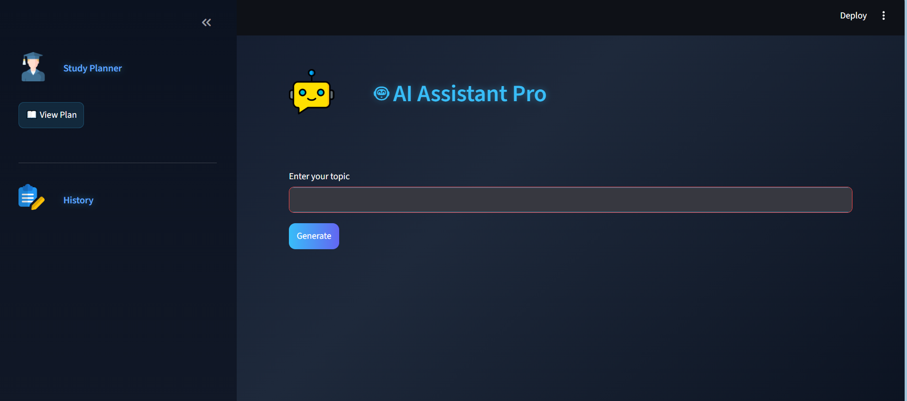
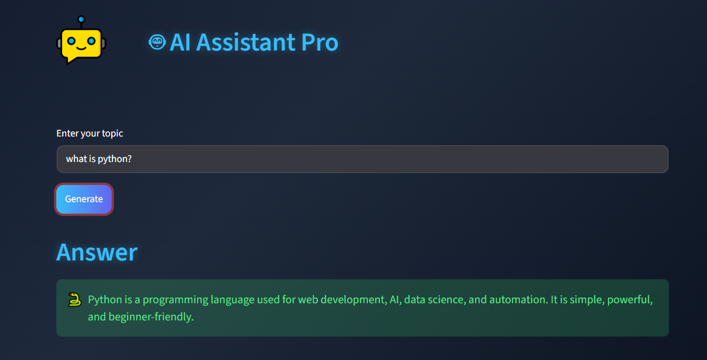
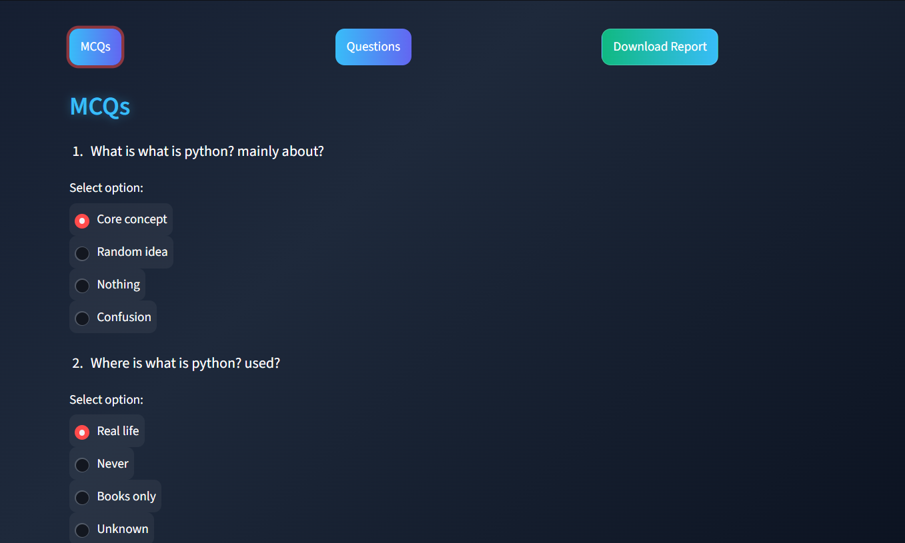
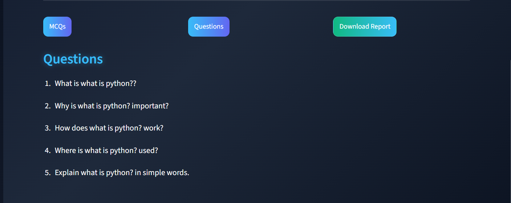

# 🤖 AI Assistant Pro

An AI-powered study assistant that helps students generate summaries, quizzes, questions, and study plans.

---

## 🎥 Demo Video

https://drive.google.com/file/d/1IFmM41gbkLqU3W0B7Y-xPY_d49I4MG3P/view

---

## 🚀 Features

- Summaries
- Quiz generation
- Questions
- Study planning

---

## ⚙️ How to Run

pip install -r requirements.txt  
streamlit run app.py

---

## 📸 Screenshots

### 🏠 Home Page

### 🧠 Summary

### 🧾 MCQs

### ❓ Questions

### 🤖 AI Assistant UI

---

## 👩‍💻 Author

Mehak
